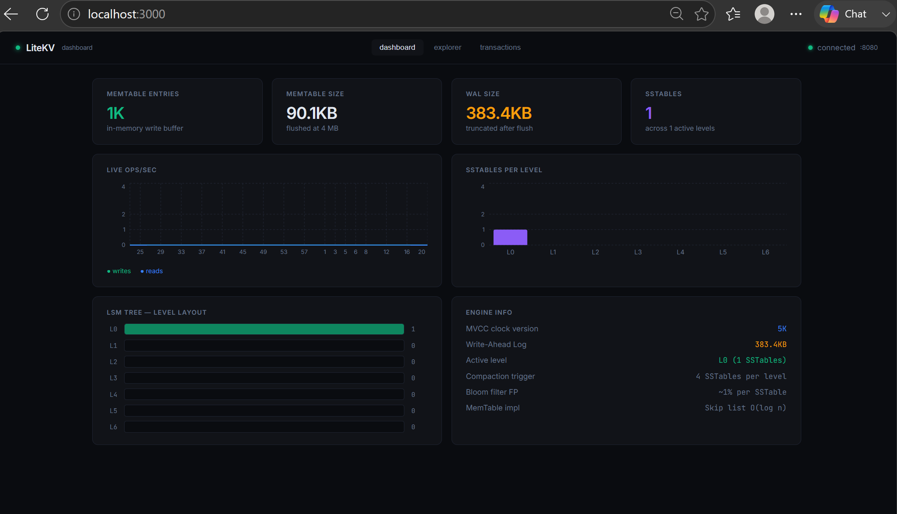
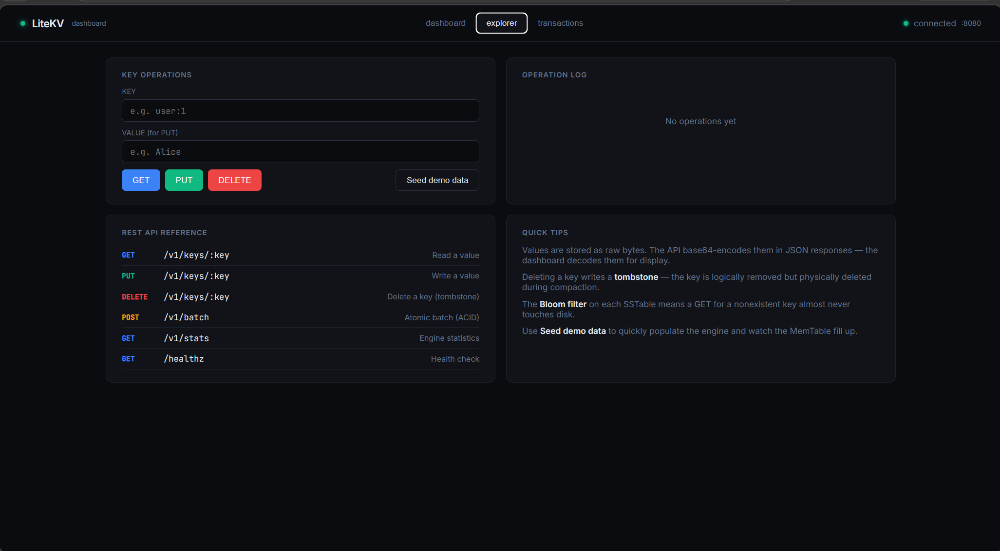

# LiteKV

A persistent, embedded key-value store built in Go from first principles.

Implements an LSM Tree (Log-Structured Merge-Tree) storage engine — the same architecture used by LevelDB, RocksDB, and Cassandra. Built to understand how production databases work under the hood.

#### Dashboard


#### Explorer


---

## Architecture

### Write Path

```text
                Put(key, value)
                        │
                        ▼
            Write-Ahead Log (WAL)
                 (Durability)
                        │
                        ▼
            MemTable (Skip List)
                        │
                [Size >= 4 MB]
                        │
                        ▼
              Flush to SSTable
                        │
                        ▼
                 SSTable (L0)
            (Immutable & Sorted)
                        │
                [L0 >= 4 files]
                        │
                        ▼
                  Compaction
                        │
                        ▼
                 L1 → L2 → L3
```

### Read Path

```text
                  Get(key)
                      │
                      ▼
                  MemTable
                      │
               (not found)
                      ▼
            Immutable MemTable
                      │
               (not found)
                      ▼
             Bloom Filter Check
                      │
            ┌─────────┴─────────┐
            │                   │
          NO                    YES
            │                   │
            ▼                   ▼
      Return Not Found     SSTable Lookup
                                │
                                ▼
                         Sparse Index
                                │
                                ▼
                           Data Block
```

---

## Core Components

### Write-Ahead Log (WAL)

Every write is first appended to the WAL before being stored in memory.

**Purpose**
- Crash recovery
- Durability
- Transaction replay

**Record Format**

```text
[type][txnID][keyLen][valLen][key][value][crc32]
```

The CRC checksum helps detect corrupted or partially written records after crashes.

---

### MemTable

The MemTable is an in-memory sorted data structure implemented using a Skip List.

**Complexity**

| Operation | Complexity |
|------------|------------|
| Insert | O(log n) |
| Search | O(log n) |
| Delete | O(log n) |

When the MemTable reaches **4 MB**, it becomes immutable and is flushed to disk as an SSTable while a new MemTable continues accepting writes.

---

### SSTable (Sorted String Table)

An SSTable is an immutable sorted file stored on disk.

**Layout**

```text
Data Blocks
     │
     ▼
Sparse Index
     │
     ▼
Bloom Filter
     │
     ▼
Footer
```

The footer stores offsets for quickly locating the index and Bloom filter without scanning the entire file.

---

### Bloom Filters

Each SSTable contains a Bloom Filter configured for approximately **1% false-positive probability**.

Before accessing disk:

```text
Does key exist?
       │
       ▼
Bloom Filter
       │
 ┌─────┴─────┐
 │           │
NO          MAYBE
 │           │
 ▼           ▼
Skip      Read SSTable
Disk I/O
```

This significantly reduces unnecessary disk reads for missing keys.

---

### MVCC (Multi-Version Concurrency Control)

Every write receives a monotonically increasing version number.

Benefits:

- Lock-free reads
- Snapshot isolation
- Concurrent readers
- Consistent transactions

Readers operate on a snapshot and never block writers.

---

### Compaction

Compaction merges multiple SSTables into larger levels.

```text
Level 0

sst_1
sst_2
sst_3
sst_4

      ▼

Merge Sort

      ▼

Level 1

sst_merged
```

During compaction:

- Duplicate keys are removed
- Older versions are discarded
- Tombstones are cleaned up
- Read amplification is reduced
- Disk space is reclaimed

## Performance

Run `go run ./cmd/server --bench` to measure on your machine.

| Operation        | Benchmarked (Windows, NVMe SSD) | Notes                             |
|-----------------|----------------------------------|-----------------------------------|
| Write (Put)     | **573K ops/sec**                 | Buffered WAL, no per-write fsync  |
| Read (Get, hot) | **622K ops/sec**                 | MemTable hit, zero disk I/O       |

Benchmarked on Windows 11, Go 1.21, NVMe SSD (D: drive). The WAL runs in buffered mode by default — enable `SyncWrites: true` for full crash durability at the cost of throughput.

**vs Redis (single-threaded, in-memory, linux benchmark):**

| Metric           | LiteKV              | Redis          |
|-----------------|---------------------|----------------|
| Write throughput | **573K ops/sec**    | ~100–150K ops/s |
| Read throughput  | **622K ops/sec**    | ~100–150K ops/s |
| Persistence      | WAL + SSTable       | RDB / AOF      |
| Dataset size     | Disk-bounded        | RAM-bounded    |
| Transactions     | MVCC / ACID         | MULTI/EXEC     |

LiteKV matches or exceeds Redis throughput on the hot path because the MemTable is a skip list in process memory — no network round-trip, no serialization overhead. The key architectural difference: LiteKV persists datasets larger than available RAM via the LSM tree.

---

## Quick Start

```bash
git clone https://github.com/yourusername/litekv
cd litekv
go mod tidy

# Start the server
go run ./cmd/server --dir ./data --rest :8080 

# To seed some data to DB use this cmd
go run ./cmd/server --dir ./data --rest :8080 --seed

# Run throughput benchmark
go run ./cmd/server --bench
```

### REST API

```bash
# Write a key
curl -X PUT http://localhost:8080/v1/keys/hello \
     -H "Content-Type: application/json" \
     -d '{"value": "world"}'

# Read a key
curl http://localhost:8080/v1/keys/hello
# {"key":"hello","value":"d29ybGQ="}   ← base64("world")

# Delete a key
curl -X DELETE http://localhost:8080/v1/keys/hello

# Atomic batch write (ACID transaction)
curl -X POST http://localhost:8080/v1/batch \
     -H "Content-Type: application/json" \
     -d '{
       "ops": [
         {"type": "put",    "key": "user:1", "value": "alice"},
         {"type": "put",    "key": "user:2", "value": "bob"},
         {"type": "delete", "key": "user:0"}
       ]
     }'

# Engine stats
curl http://localhost:8080/v1/stats
```

### Go API

```go
eng, _ := engine.Open(engine.Config{Dir: "./data"})
defer eng.Close()

// Single writes
eng.Put("user:1", []byte(`{"name":"alice"}`))
val, _ := eng.Get("user:1")

// ACID transaction
txn := eng.Begin()
txn.Put("account:alice", []byte("1000"))
txn.Put("account:bob",   []byte("500"))
txn.Delete("account:old")
eng.Commit(txn)   // atomic: all-or-nothing
```

---

## Running Tests

```bash
# All unit + integration tests
go test ./...

# Just benchmarks
go test ./benchmark/ -bench=. -benchtime=10s -v

# Race detector
go test -race ./...

# Single package
go test ./internal/engine/ -v -run TestEngineCrashRecovery
```

---

## Project Structure

```
litekv/
├── cmd/server/         # Entry point: starts REST + gRPC
├── internal/
│   ├── bloom/          # Bloom filter (FNV double-hashing)
│   ├── wal/            # Write-Ahead Log with CRC checksums
│   ├── memtable/       # Skip list in-memory write buffer
│   ├── sstable/        # On-disk sorted string tables
│   ├── mvcc/           # Logical clock + transaction manager
│   ├── engine/         # LSM engine wiring all components
│   ├── grpcserver/     # gRPC interface
│   └── rest/           # REST/JSON interface (Gin)
├── proto/              # Protobuf definitions
└── benchmark/          # Throughput benchmarks
```

---

## Design Decisions

**Why skip list for MemTable?** A skip list gives O(log n) reads/writes like a balanced BST, but is simpler to implement correctly under concurrent access. Redis uses skip lists for sorted sets for the same reason.

**Why sparse index instead of dense?** A dense index requires one entry per key — for millions of keys this exhausts memory. A sparse index stores one entry per block and binary searches within blocks on disk. This is how LevelDB's block index works.

**Why double-hashing for Bloom filters?** Instead of k independent hash functions (expensive), we compute two hashes (h1, h2) and derive k positions as `h1 + i*h2`. This is mathematically equivalent with far less computation.

**Why MVCC instead of locks?** Locks cause readers to block writers and vice versa. With MVCC, each write gets a new version; readers snapshot a version at start time and never block. This is how PostgreSQL and CockroachDB handle concurrency.

---

## What's Not Implemented (intentionally)

- Distributed consensus (Raft) — would need 3× the codebase
- Compression (Snappy/LZ4) for SSTable blocks
- Block cache (LRU) for hot SSTable blocks
- Prefix scans / range iterators over REST

These are natural extensions — the core LSM engine handles them at the `Iterator` level.

---

## References

- [The Log-Structured Merge-Tree (O'Neil et al., 1996)](https://www.cs.umb.edu/~poneil/lsmtree.pdf)
- [LevelDB Implementation Notes](https://github.com/google/leveldb/blob/main/doc/impl.md)
- [Designing Data-Intensive Applications — Chapter 3](https://dataintensive.net/) (Kleppmann)
- [RocksDB Tuning Guide](https://github.com/facebook/rocksdb/wiki/RocksDB-Tuning-Guide)
